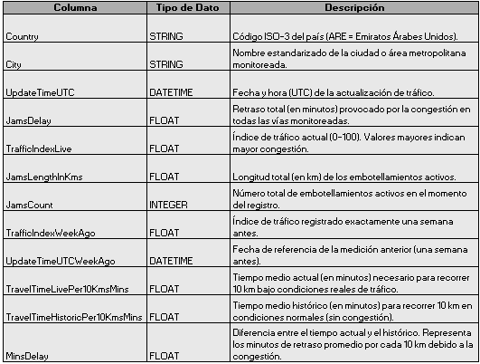

### Movilidad urbana y productividad económica en ciudades de LATAM
Analizar la relación entre la movilidad urbana (niveles de congestión, tiempos de viaje, retrasos) y la productividad económica (PIB per cápita, desempleo) en las principales ciudades latinoamericanas.
Eres analista de datos en el Latin American Development Bank y tu equipo debe entregar un reporte, ya que el objetivo del banco es identificar en qué ciudades invertir en infraestructura de transporte para aumentar la productividad y el bienestar de la población.
Para ello, se usaron dos fuentes reales de datos:
Movilidad urbana: TomTom Traffic Index (datos de tráfico en tiempo real).
Economía urbana: OECD Cities (PIB per cápita, desempleo y población).
La misión fue limpiar, unir y analizar ambas bases para obtener información útil para la toma de decisiones.

### **Preguntas del negocio**
1. ¿Qué ciudades de América Latina presentan alta congestión y baja productividad económica?
2. ¿Cuáles muestran los mejores indicadores combinados (movilidad eficiente y economía fuerte)?
3. ¿Qué variables parecen tener una relación más fuerte con el desarrollo urbano?

### **Herramientas tenológicas** 
 • Jupyter Notebook
 
 • Python: pandas, numpy, seaborn, matplotlib

### **Dataset del proyecto**
Fuentes principales de información:
1. tomtom_traffic.csv : Datos sobre congestión vehicular y condiciones de tráfico en ciudades del mundo.
2. oecd_city_economy.csv : Indicadores económicos y ambientales por ciudad, recopilados por la OECD (Organización para la Cooperación y el Desarrollo Económico).
   
Ambas tablas se complementan para entender cómo la eficiencia del tráfico urbano se relaciona con el desempeño económico en ciudades latinoamericanas.

## **Dataset 1: tomtom_traffic.csv**

Registra información sobre niveles de tráfico y congestión en tiempo real en distintas ciudades monitoreadas por TomTom, una empresa global de geolocalización.
Cada registro corresponde a una actualización puntual del estado del tráfico en una ciudad.

## **Dataset 2: oecd_city_economy.csv**

Contiene indicadores anuales sobre economía urbana, empleo, contaminación y población recopilados por la OECD (Organización para la Cooperación y el Desarrollo Económicos).
Cada registro representa una ciudad en un año específico, lo que permite comparar niveles de productividad y desarrollo urbano entre países.

