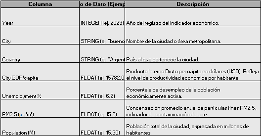
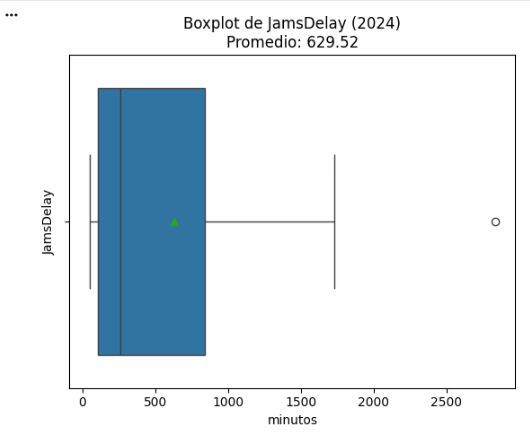
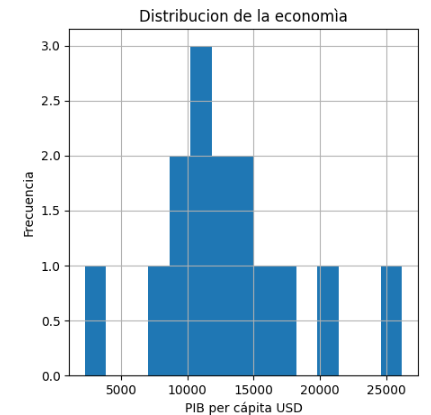
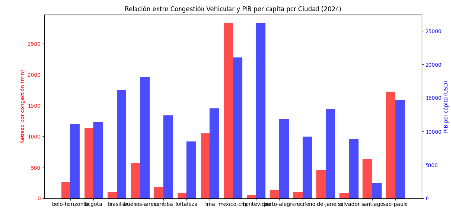

### Movilidad urbana y productividad económica en ciudades de LATAM
Análisis de la relación entre la movilidad urbana (niveles de congestión, tiempos de viaje, retrasos) y la productividad económica (PIB per cápita, desempleo) en las principales ciudades latinoamericanas.
Este proyecto se desarrolla en el contexto de un equipo de análisis de datos del Latin American Development Bank, con el objetivo de identificar en qué ciudades invertir en infraestructura de transporte para mejorar la productividad y el bienestar de la población.
Para ello, se usaron dos fuentes reales de datos:
Movilidad urbana: TomTom Traffic Index (datos de tráfico en tiempo real).
Economía urbana: OECD Cities (PIB per cápita, desempleo y población).

La misión fue limpiar, unir y analizar ambas bases para generar insights accionables.

### **Preguntas del negocio**
1. ¿Qué ciudades de América Latina presentan alta congestión y baja productividad económica?
2. ¿Cuáles muestran los mejores indicadores combinados (movilidad eficiente y economía fuerte)?
3. ¿Qué variables parecen tener una relación más fuerte con el desarrollo urbano?

### **Herramientas tenológicas** 
 • Jupyter Notebook
 
 • Python: pandas, numpy, seaborn, matplotlib

### **Dataset del proyecto**
Fuentes principales de información:
1. tomtom_traffic.csv : Datos sobre congestión vehicular y condiciones de tráfico en ciudades del mundo.
2. oecd_city_economy.csv : Indicadores económicos y ambientales por ciudad, recopilados por la OECD (Organización para la Cooperación y el Desarrollo Económico).
   
Ambas tablas se complementan para entender cómo la eficiencia del tráfico urbano se relaciona con el desempeño económico en ciudades latinoamericanas.

## **Dataset 1: tomtom_traffic.csv**

Registra información sobre niveles de tráfico y congestión en tiempo real en distintas ciudades monitoreadas por TomTom, una empresa global de geolocalización.
Cada registro corresponde a una actualización puntual del estado del tráfico en una ciudad.

## **Dataset 2: oecd_city_economy.csv**

Contiene indicadores anuales sobre economía urbana, empleo, contaminación y población recopilados por la OECD (Organización para la Cooperación y el Desarrollo Económicos).
Cada registro representa una ciudad en un año específico, lo que permite comparar niveles de productividad y desarrollo urbano entre países.

### **Plan de acción**

Construir una tabla unificada que combine variables de movilidad urbana (TomTom) con variables económicas (OECD) para ciudades de América Latina en 2024.
El objetivo es generar una base de datos limpia y estandarizada para analizar cómo la movilidad impacta la productividad económica.

### **Metodología**
1. Exploración de datos: Identificación de columnas, tipos de datos y estructura general.
2. Limpieza de datos: Estandarización de nombres de columnas y corrección de tipos de datos.
3. Estandarización y filtrado de fecha: El período más reciente y relevante, el año 2024.
4. Agregación de datos: Cálculo de promedios de tráfico por ciudad.
5. Unión de datasets: Integración de datos de movilidad y economía en una sola tabla.
6. Análisis y visualización: Generación de gráficos para identificar patrones y relaciones entre variables.

### **Resultados clave**

Análisis de distribución del tráfico (jams_delay) – 2024

El promedio de retraso es de aproximadamente 629.52 minutos anuales. Sin embargo, la mayoría de los valores se concentran por debajo de los 1,000 minutos, lo que indica que algunas ciudades presentan niveles de congestión considerablemente más altos que el resto.

La distribución muestra una asimetría positiva (sesgo a la derecha), evidenciada por la presencia de valores elevados que extienden la cola superior. Esto sugiere que existen ciudades con niveles de tráfico significativamente superiores al promedio.

Asimismo, se identifica al menos un valor atípico por encima de los 2,500 minutos, lo que refuerza la existencia de alta variabilidad en la congestión urbana entre ciudades.

Análisis de distribución económica (city_gdp_capita) – 2024

Se observa que la mayoría de las ciudades presentan un PIB per cápita en el rango aproximado de 10,000 a 15,000 USD, lo que indica una concentración en niveles económicos medios dentro de la muestra.

Asimismo, existen valores en los extremos —por debajo de 5,000 USD y por encima de 25,000 USD— que sugieren la presencia de alta variabilidad entre ciudades. Esto indica diferencias significativas en el nivel económico, más que una “distribución anormal”.

### **Conclusiones generales**

Relación entre PIB y congestión

No se identifica una relación lineal consistente entre ambas variables. Aunque algunos casos sugieren una tendencia inversa, existen suficientes excepciones que impiden generalizar esta relación. Ciudades con alta congestión y menor nivel económico Ciudades como Bogotá y Lima presentan niveles elevados de congestión junto con niveles económicos medios, lo que puede indicar oportunidades de mejora en infraestructura de transporte.

Mejores indicadores combinados

Montevideo destaca por presentar bajo nivel de congestión y alto PIB per cápita. Buenos Aires también muestra un balance favorable en comparación con otras ciudades. Interpretación general Los resultados indican que el nivel económico por sí solo no explica los niveles de congestión. Es necesario considerar variables adicionales para entender la movilidad urbana de manera integral.

### **Recomendaciones de inversión**

Las ciudades con alta congestión y niveles económicos medios, como Bogotá y Lima, podrían ser prioritarias para inversión en infraestructura de transporte, ya que mejoras en movilidad podrían tener un impacto positivo en la productividad y calidad de vida.
No obstante, se recomienda complementar este análisis con variables adicionales (densidad poblacional, transporte público, expansión urbana) antes de tomar decisiones de inversión.
